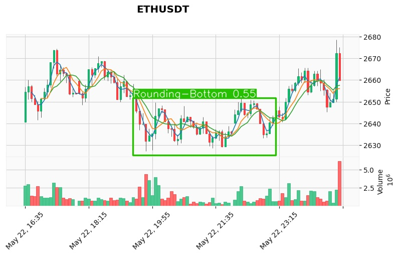

# Pattern Detection System Using YOLO in DToD V2.1

Chart pattern detection is a critical component of swing trading, as it helps traders identify potential price movements based on historical price action. The Data To Dollar (DToD) V2.1 trading bot incorporates advanced pattern detection using the YOLO (You Only Look Once) model, a state-of-the-art object detection framework. This section provides a detailed explanation of how the YOLO-based pattern detection system works, tailored to help beginners understand its significance and functionality in swing trading.

## Why Chart Pattern Detection Matters in Swing Trading
Chart patterns, such as cup-and-handle, double bottom, or candlestick formations like Marubozu and Morning Star, are visual representations of market psychology and price behavior. These patterns often signal potential reversals or continuations in price trends, making them essential for swing traders who aim to capitalize on short- to medium-term price movements. However, identifying these patterns manually can be challenging for beginners due to the complexity and subjectivity involved. The YOLO-based system in DToD V2.1 automates this process, offering precision and efficiency.

## How YOLO Powers Pattern Detection
The YOLO model, originally designed for real-time object detection in images, is adapted in DToD V2.1 to analyze stock price charts. It treats chart patterns as "objects" within the price chart image, detecting them with high accuracy and speed. The system uses two specialized YOLO models to cater to different types of patterns:

1. **Large-Scale Chart Pattern Detection**  
   This model identifies macro-level chart patterns that form over longer timeframes, such as:
   - **Cup-and-Handle**: A bullish continuation pattern indicating a potential upward breakout.
   - **Double Bottom**: A reversal pattern signaling a potential uptrend after a downtrend.
   - **Head and Shoulders**: A reversal pattern suggesting a shift from bullish to bearish or vice versa.  
   The model processes the chart as an image, scanning for these formations by analyzing the shape and structure of price movements.  
   *Example Visualizations*:  
     
   

2. **Candlestick Pattern Detection**  
   This model focuses on smaller, short-term candlestick patterns that are critical for precise entry and exit points in swing trading. Examples include:
   - **Marubozu**: A strong bullish or bearish candle with little to no shadows, indicating strong momentum.
   - **Morning Star**: A three-candle reversal pattern signaling a potential bullish trend.
   - **Doji**: A candle indicating indecision in the market, often preceding a reversal.  
   The candlestick YOLO model zooms in on individual or small groups of candles to detect these micro-patterns with high precision.  
   *Example Visualizations*:  
     
   

## How the YOLO Model Works in DToD V2.1
The YOLO model operates by dividing a price chart into a grid and predicting bounding boxes around detected patterns, along with confidence scores indicating the likelihood of a pattern's presence. Here's a simplified breakdown of the process:
1. **Input Processing**: The stock chart is converted into an image format that YOLO can analyze.
2. **Pattern Recognition**: The model scans the chart for predefined patterns (both large-scale and candlestick) based on its training data.
3. **Bounding Box Prediction**: For each detected pattern, YOLO draws a bounding box around the relevant area of the chart and labels it (e.g., "Cup-and-Handle" or "Marubozu").
4. **Confidence Scoring**: The model assigns a confidence score to each detected pattern, helping traders prioritize high-probability signals.
5. **Output**: The detected patterns are overlaid on the chart, providing visual cues for traders to make informed decisions.

## Why YOLO is Effective for Chart Pattern Detection
- **Speed**: YOLO processes charts in real-time, making it suitable for fast-paced swing trading environments.
- **Accuracy**: The model is trained on extensive datasets of historical chart patterns, enabling it to recognize patterns with high precision.
- **Automation**: By automating pattern detection, YOLO eliminates human bias and reduces the learning curve for beginners.
- **Scalability**: The system can be trained to detect new patterns as market dynamics evolve.

## Benefits for Beginners
For those new to swing trading, the YOLO-based pattern detection system in DToD V2.1 simplifies the process of identifying actionable trading signals:
- **Ease of Use**: No need to manually study complex chart patterns; the system highlights them automatically.
- **Educational Value**: Visualizations of detected patterns (e.g., images/yolo1.png) help beginners learn to recognize patterns over time.
- **Confidence in Trading**: High-confidence pattern detections provide reassurance for novice traders making decisions.
- **Time Efficiency**: The automation saves time, allowing beginners to focus on strategy rather than chart analysis.

## Practical Application in Swing Trading
In swing trading, timing is critical. The YOLO system in DToD V2.1 enhances trading strategies by:
- **Identifying Entry Points**: For example, detecting a Morning Star pattern may signal a buy opportunity at the start of a bullish trend.
- **Spotting Exit Points**: A Head and Shoulders pattern might indicate a trend reversal, prompting traders to exit a position.
- **Combining with Indicators**: The detected patterns can be used alongside technical indicators like RSI or MACD for confirmation, creating a robust trading strategy.

## Conclusion
The YOLO-based pattern detection system in DToD V2.1 is a powerful tool for swing traders, particularly beginners, as it automates the complex task of chart pattern recognition. By leveraging two specialized YOLO models—one for large-scale chart patterns and another for candlestick formations—the system provides accurate, real-time insights into market trends. This allows traders to make informed decisions with greater confidence, ultimately enhancing their ability to capitalize on short- to medium-term price movements.

For further inquiries or support, contact:  
**Email**: frosty.alce000@gmail.com  
**Telegram**: @frostyalce000